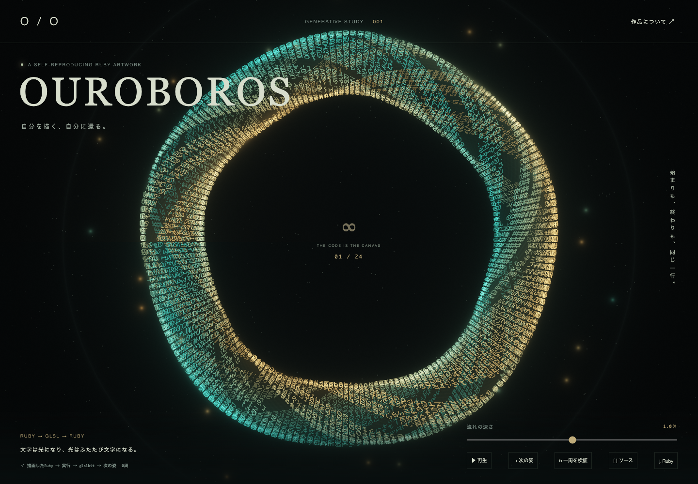
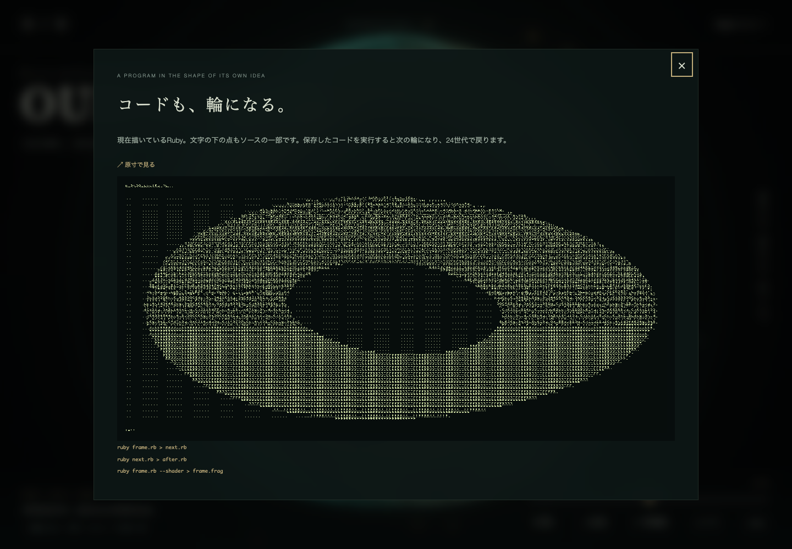

# glslkit Quine — OUROBOROS

**自分を描く、自分に還る。** 描かれたRubyを実行すると次の姿を描くRubyが生まれ、24世代で最初へ戻る、動く周期Quineです。

**[公開作品を開く](https://glslkit-quine.lolipop-now.app/)** · [frame.fragビューア](https://glslkit-quine.lolipop-now.app/public/frame-viewer.html)



48本の光の糸に、その世代のRubyコードが流れます。形と色はコードの世代に従って変化し、ポインターにも反応します。

```text
描画ピクセル → Rubyを復元 → Rubyで実行 → 次のRuby
                                           ↓
次の姿を描画 ← WebGL2 ← glslkitで検証・解析 ← GLSL生成
```

1回で同じコードを出力する通常のQuineとは異なり、24回の実行で元に戻る**周期Quine**です。次の世代を作るRubyは、自分のファイルや外部入力を読みません。

## 起動

Ruby 3.3.3、Bundler 2.6系、Node.js / npm、WebGL2対応ブラウザを使用します。

```sh
git clone git@github.com:kyubey1228/glslkit-Quine.git
cd glslkit-Quine
ruby bin/setup
bundle exec ruby bin/rails server -b 127.0.0.1 -p 3100
```

[http://127.0.0.1:3100/](http://127.0.0.1:3100/) を開いてください。初回はブラウザ内のRuby処理系の準備に数秒かかります。

`bin/setup` はRubyとnpmの依存をインストールし、Quine・シェーダー・ブラウザ用ランタイム・単体HTMLを生成します。glslkitはGemfile / Gemfile.lockで使用コミットを固定しています。

生成された `index.html` はブラウザで直接開くこともできます。Ruby処理系とglslkitを内包するため約42MBありますが、生成後はCDN・サーバー・ネット接続を必要としません。

## ロリポップ！デプロイ nowで公開する

生成した静的版を公開できます。ブラウザ内でRubyとglslkitを実行するため、公開先にRailsサーバーは必要ありません。

[公式の静的サイト対応](https://deploy.lolipop.jp/docs/frameworks/static)を利用し、`index.html` とビューアだけをアップロードします。CLIはGitで無視された生成ファイルを除外するため、公開用フォルダをGitの外へ書き出します。

```sh
lolipop login
deploy_dir="$(bundle exec ruby bin/export-static)"
lolipop deploy --dir "$deploy_dir" --name glslkit-quine --framework static
```

初回公開後の更新は、作成されたプロジェクトIDを指定します。

```sh
deploy_dir="$(bundle exec ruby bin/export-static)"
lolipop deploy --dir "$deploy_dir" --project 01M4FPMKHG60P3WCC16MK61478
```

この作品の公開先ではCLIから静的成果物をアップロードしています。GitHubへのpushだけでは自動公開されません。

## 操作

- **流れの速さ / 静止・再生**：Rubyを実行して世代を進める速度を調整します。
- **次の姿**：描画したコードを読み取り、Rubyを1回実行します。
- **一周を検証**：24世代を実行し、一周後のソースが開始時と全バイト一致することを確認します。
- **ソース**：現在の世代のRubyを、GPUが描いたコードシートで表示します。全体表示と原寸表示を切り替えられます。
- **.fragを見る**：作品画面右上、またはソース画面からビューアを開き、生成した `frame.frag` を選択・ドラッグ＆ドロップしてその世代の姿を表示します。
- **コードをコピー**：ソース画面から、描画ピクセルで復元した現在のRubyを改行・空白ごとコピーします。
- **Ruby**：コードシートのピクセルから取り出した、現在の世代のRubyを保存します。

OSの「視差効果を減らす」が有効なら静止から始まります。

## 描いたコードを実行する仕組み



完全なRubyソースをコードシートに描きます。字形だけでは空白や似た文字を区別できないため、各文字の下に8ビットの点列も描き、改行も表現しています。

表示Canvasのピクセルから点列を読み取り、Rubyを復元します。そのRubyをブラウザ内のCRuby 4.0（ruby.wasm）で実行し、標準出力を次の世代として受け取ります。JavaScriptで世代番号を書き換えたり、事前に用意した24枚の一覧を切り替えたりする仕組みではありません。

次のRubyを `--shader` モードで実行すると、その世代のコードと姿を含むGLSLが生まれます。絵の変化はこのGLSL内の `PHASE` で決まり、時刻uniformだけで動かしてはいません。

### glslkitの役割

初期シェーダーは **glslkit-rails** の `glsl_script_tag` / `glsl_manifest_tag` とPropshaftで配信します。その後はブラウザ内でもglslkit本体を実行し、**毎世代 `Glslkit::Bundle.build`** で検証・前処理・リフレクションを行います。得たmanifestのsetterでWebGLのuniformを更新します。

## 保存したRubyを実行する

```sh
ruby public/ouroboros.rb > next.rb
ruby next.rb > after.rb
ruby public/ouroboros.rb --shader > frame.frag
```

生成した `frame.frag` は、作品画面の「.fragを見る」から開くビューアで表示できます。ビューアはセットアップ時に生成され、Rails版と単体HTML版のどちらからも参照できます。

通常実行は次のRubyだけを出力し、`--shader` はその世代自身のGLSLを出力する追加モードです。

24世代の循環は、次のように単独でも確認できます。

```sh
ruby -ropen3 -e '
  original = File.binread("public/ouroboros.rb")
  current = original
  24.times do
    current, status = Open3.capture2("ruby", stdin_data: current)
    abort "execution failed" unless status.success?
  end
  abort "cycle mismatch" unless current.b == original.b
  puts "24 generations: byte-exact cycle"
'
```

## 開発と検証

```sh
bundle exec ruby build.rb
bundle exec ruby test/verify.rb
bundle exec ruby test/run_browser.rb
```

ブラウザ検証にはChrome / Chromiumが必要です。自動検出されない場合は、実行ファイルの絶対パスを `CHROME` 環境変数で指定してください。

- `scene.frag.in`：作品のシェーダーテンプレート。
- `build.rb`：24世代の実行・循環確認と、各生成物のビルド。
- `lib/font.rb`：字形のビットマップ。
- `public/gallery.js`：描画ピクセルの読み取り、Ruby実行、glslkit処理、世代交代。
- `test/verify.rb`：標準入力からの24世代循環、minify後のコード保持、Rails配信の検証。
- `test/run_browser.rb`：実際の描画からの抽出、自動再生、24世代の実行、コードと絵の循環など24項目の検証。

CRuby 3.3.3で3テスト・148アサーション、Chrome / WebGL2で24項目の成功を確認しています。[ブラウザ検証結果](test/browser-result.json)も記録しています。Safari / Firefoxは未検証です。スマホで報告されたコードシートの読み取り失敗への対策として、ソースの定数配列を最大256要素ずつに分割しています。配列分割だけではAndroid / Chromeの読み取り失敗が解消しなかったため、コードシートは光の輪の描画処理を除いた専用プログラムで描画します。失敗時にはGPUの点列と直接読んだバイトも表示し、Canvasへの転送前後を比較できます。この追加対策はスマホ実機では未確認です。

`node_modules`、Rubyランタイム、約42MBの単体HTMLなどの再生成可能なファイルはGitに含めません。実行できるQuineと初期GLSL、画像はリポジトリに含めています。

初期移行は `main` にまとめています。今後の機能変更は `feat/...`、修正は `fix/...` ブランチで進め、再生成と検証を通してから `main` に取り込みます。

## 参考

- [glslkit](https://github.com/kyubey1228/glslkit)
- [ruby.wasm](https://github.com/ruby/ruby.wasm)
- [Quineから始めるRuby超絶技巧プログラミング入門](https://qiita.com/wataru86/items/adfa71048a206ffe6ffa)
- [RubyKaigi 2024をきっかけにQuineに入門してみた](https://tech.findy.co.jp/entry/2024/05/23/093756)

MIT License。使用するRuby処理系と依存ライブラリのライセンスは、それぞれの配布物を参照してください。
